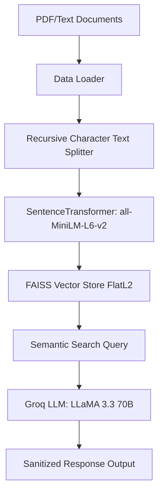

# Modular RAG Pipeline
A modular, lightweight **Retrieval-Augmented Generation (RAG) Pipeline** built from scratch in Python. The system parses local PDF documents, processes and chunks the text, creates vector embeddings, indexes them using **FAISS**, and utilizes **Groq-hosted LLaMA 3.3 70B** to generate accurate, context-aware answers to natural language queries.
---
## 🏗️ Architecture Flow

---
## 📂 Project Structure
```
├── data/                  # Local source documents (ignored by git)
│   ├── pdf_files/         # PDF documents to ingest
│   └── text_files/        # Text files to ingest
├── faiss_store/           # Persisted FAISS index & metadata (ignored by git)
├── src/
│   ├── __init__.py
│   ├── data_loader.py     # Document loaders and metadata parsing
│   ├── embedding.py       # Text splitting and embedding generation
│   ├── vectorstore.py     # FAISS vector database management
│   └── search.py          # Query orchestration & LLM generation
├── .env.example           # Example environment variables template
├── app.py                 # Main application entry point
├── pyproject.toml         # Project dependencies and configuration
└── requirements.txt       # Python dependencies
```
---
## 🛠️ Tech Stack
- **Core Language:** Python 3.11+
- **Orchestration:** LangChain / LangChain-Community
- **Embeddings:** SentenceTransformers (`all-MiniLM-L6-v2`)
- **Vector Store:** FAISS (Facebook AI Similarity Search)
- **LLM API:** Groq (`llama-3.3-70b-versatile` / `gemma2-9b-it`)
- **Document Parsers:** PyPDF / PyMuPDF
---
## 🚀 Getting Started
### 1. Prerequisites
Ensure you have Python 3.11+ installed. We recommend using `uv` or `pip` for dependency management.
### 2. Installation & Environment Setup
1. **Clone the repository:**
   ```bash
   git clone https://github.com/ag32567/Langraph-MCP_project.git
   cd RAG
   ```
2. **Create and activate a virtual environment:**
   ```bash
   # Using standard python venv
   python -m venv .venv
   source .venv/bin/activate  # On Windows: .venv\Scripts\activate
   ```
3. **Install the dependencies:**
   ```bash
   pip install -r requirements.txt
   ```
4. **Configure environment variables:**
   Copy the example environment file and add your **Groq API Key**:
   ```bash
   cp .env.example .env
   ```
   Open `.env` and enter your key:
   ```env
   GROQ_API_KEY="your_groq_api_key_here"
   ```
---
## 🏃 Running the Application
1. Place your target PDFs in the `data/pdf_files/` directory.
2. Run the main script to build the vector store (if not already built) and run a query:
   ```bash
   python app.py
   ```
---
## 🔒 Security & Best Practices
The project is pre-configured with a `.gitignore` to prevent sensitive files from being pushed to GitHub:
- `.env` (contains API keys)
- `data/` (contains raw PDF documents)
- `faiss_store/` (contains generated vector database files)
